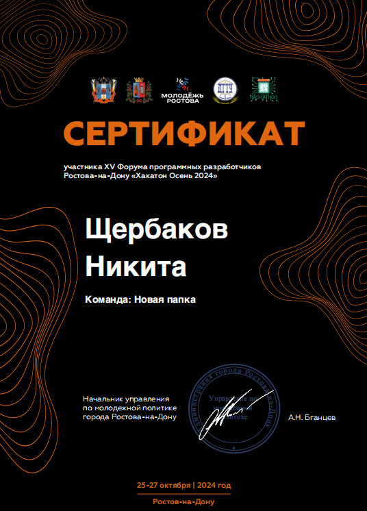
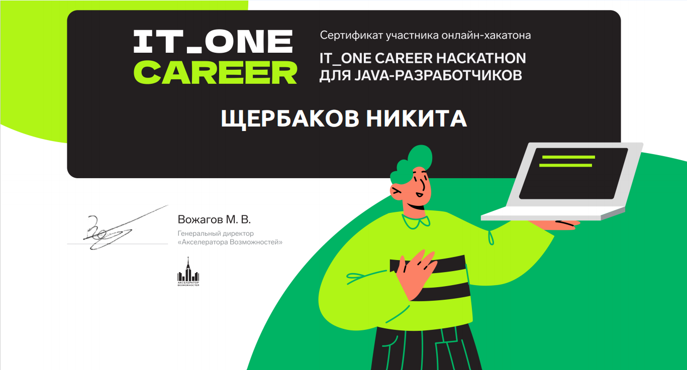
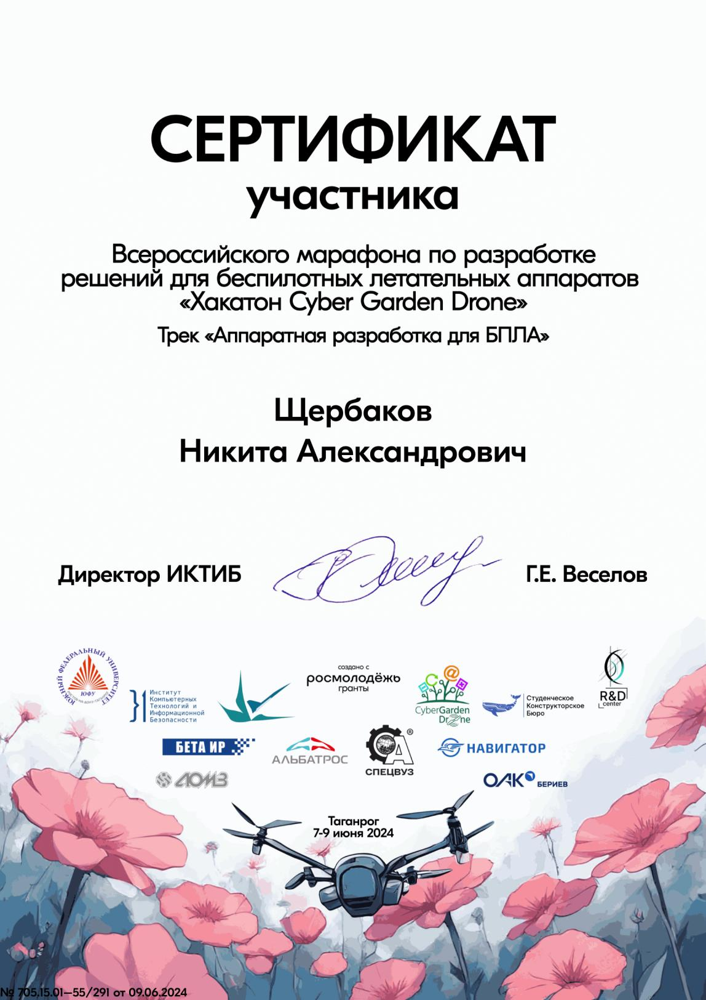
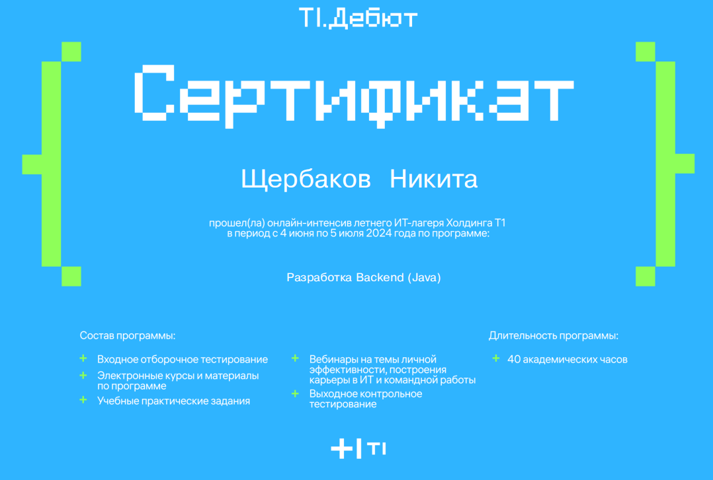

 

  

###

<h1 align="center">Привет👋 Меня зовут Никита!</h1>

###

  

###

<h3 align="left">👩‍💻  Обо мне</h3>

# Привет! 👋

Я – студент 3 курса по направлению **«Системное программирование и технологии искусственного интеллекта»**.  
Моя страсть – разработка надежных, масштабируемых и эффективных программных решений.

---

## 💻 Основные языки программирования:
- 🚀 **Java** (основной язык, которому отдаю предпочтение)
- 🐍 Python
- ⚡ C++
- 🔧 C

---

## 🛠️ Технологический стек:
- **Backend:** Java 21, Spring Boot, Spring MVC, Spring Security, Hibernate
- **Тестирование:** Junit, Mockito
- **Сборщики проекта:** Maven, Gradle
- **Базы данных:** PostgreSQL
- **DevOps & Cloud:** Docker, Kafka
- **ОС:** Ubuntu (как основная среда разработки)

---

## 🎯 О себе:
- 📌 Постоянно совершенствую навыки и углубляюсь в экосистему **Java**
- 🏗️ Интересуюсь архитектурой ПО и высоконагруженными системами
- 🧠 Исследую технологии **искусственного интеллекта**

💡 **Открыт к новым знаниям, проектам и интересным задачам!** 🚀

# 📂 Мои проекты

Здесь представлены мои лучшие проекты, разработанные в ходе обучения, работы и хакатонов.

### 🚀 **Платформа для обмена навыками и услугами**
📌 **Технологический стек:**  
**Java 21**, **Spring Boot**, **Spring Security**, **Spring Data**, **Spring Web**, **Maven**, **Spring Validation**, **PostgreSQL**, **Docker**, **JUnit**

📝 **Описание:**  
Проект предназначен для создания удобной и безопасной платформы, на которой пользователи могут обмениваться знаниями и услугами.

🔗 **Ссылка на проект:** [GitHub](https://github.com/Funtikz/SberProject)

# 🏆 Дипломы и Хакатоны

Здесь представлены мои достижения в соревнованиях, хакатонах и конкурсах. Я постоянно развиваюсь, участвуя в командных и индивидуальных соревнованиях, прокачиваю свои навыки в разработке и решении сложных задач.

## 🚀 Хакатоны и соревнования

### 🏆 **Формула программных разработчиков Ростова-на-Дону "Хакатон Осень 2024"** (2024)
 
[Презентация проекта](Новая_папка_центринвест_зеленый_ростов.pptx)
---

### 🏅 **IT_ONE_CAREER** (2024)

---

### 🏅 **Хакатон Cyber Garden Drone** (2024)

---

### 🏅 **Сертификат Java (Backend) T1** (2024)

---

## 🎯 Мои цели в соревнованиях
- 📌 Участвовать в крупных хакатонах и повышать уровень своих навыков
- 🚀 Разрабатывать инновационные проекты и искать нестандартные решения
- 🤝 Заводить новые знакомства и работать с сильными командами

💡 **Готов к новым вызовам!** Если у вас есть интересные соревнования или проекты — пишите! 🚀  
